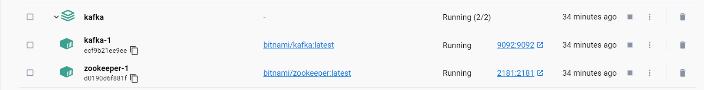
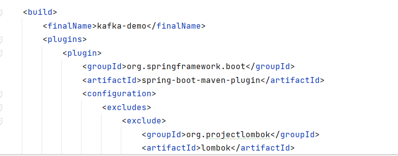

# Chat application in Websocket, Redis and Kafka
## Preprocessing
####Create docker-compose.yml file:
````yml
version: "3"
services:
  zookeeper:
    image: 'bitnami/zookeeper:latest'
    ports:
      - '2181:2181'
    environment:
      - ALLOW_ANONYMOUS_LOGIN=yes
  kafka:
    image: 'bitnami/kafka:latest'
    ports:
      - '9092:9092'
    environment:
      - KAFKA_BROKER_ID=1
      - KAFKA_CFG_LISTENERS=PLAINTEXT://:9092
      - KAFKA_CFG_ADVERTISED_LISTENERS=PLAINTEXT://127.0.0.1:9092
      - KAFKA_CFG_ZOOKEEPER_CONNECT=zookeeper:2181
      - ALLOW_PLAINTEXT_LISTENER=yes
    depends_on:
      - zookeeper

````

#### Open Terminal console:
`docker-compose up -d`

#### In Docker Desktop, there are 2 images of kafka compose


## Run project in Docker Desktop

#### Add attribute `finalName` in `application.properties`


#### Docker file:

```` Dockerfile
FROM openjdk:11-jdk-oracle
WORKDIR /app
COPY target/kafka-demo.jar app.jar
EXPOSE 8080
CMD ["java", "-jar", "app.jar"]
````

#### Terminal
* Build image: `docker build -t kafka-demo .`
* See images in docker: `docker image ls`  


* Run image: `docker run --name app -p 8080:8080 kafka-demo`


* Test topic in Kafka container with terminal:


