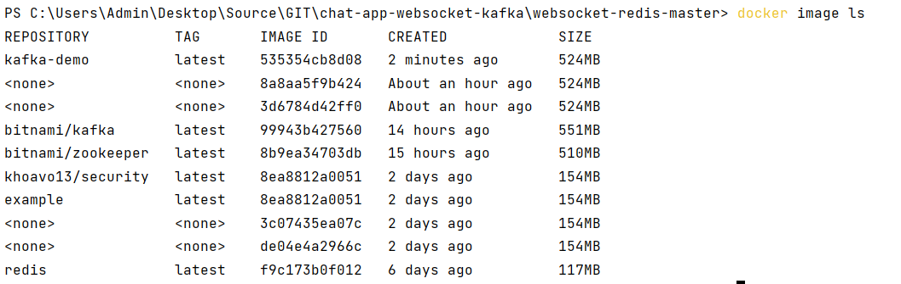
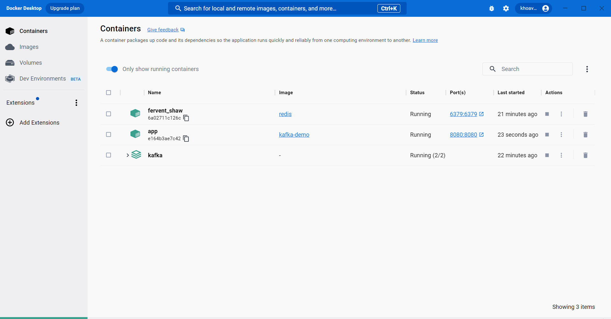
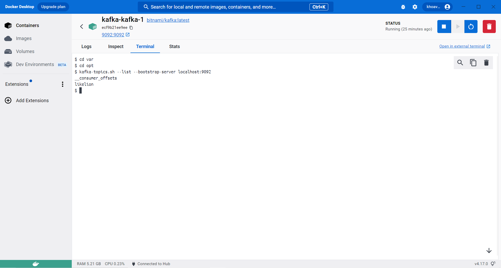

# Chat application in Websocket, Redis and Kafka


## Run project in Docker Desktop

#### Docker file:

```` Dockerfile
FROM openjdk:11-jdk-oracle
WORKDIR /app
COPY target/kafka-demo.jar app.jar
EXPOSE 8080
CMD ["java", "-jar", "app.jar"]
````

#### Terminal
* Build image: `docker build -t kafka-demo .`
* See images in docker: `docker image ls`  


* Run image: `docker run --name app -p 8080:8080 kafka-demo`


* Test topic in Kafka container with terminal:



